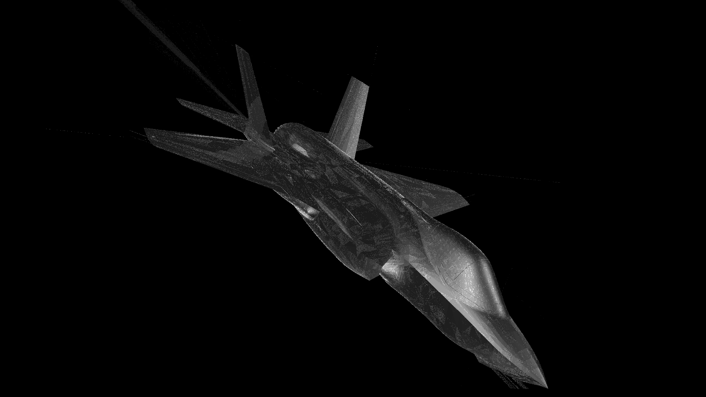
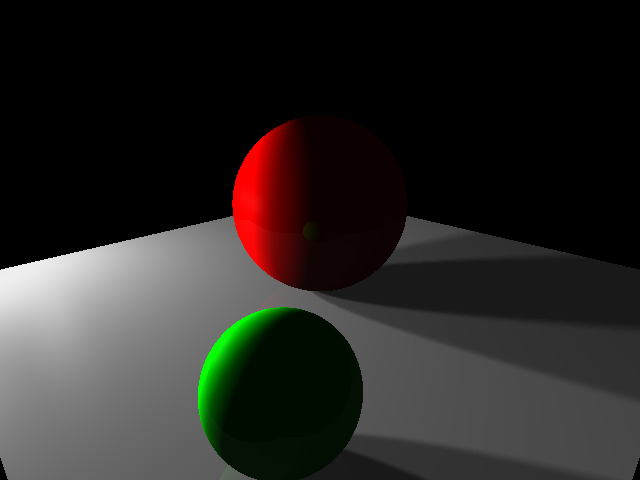
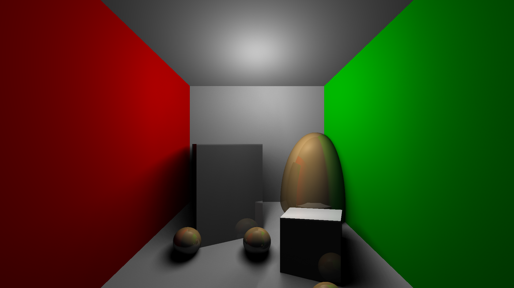
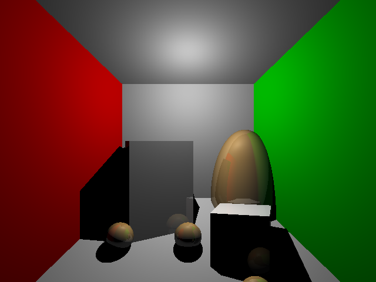
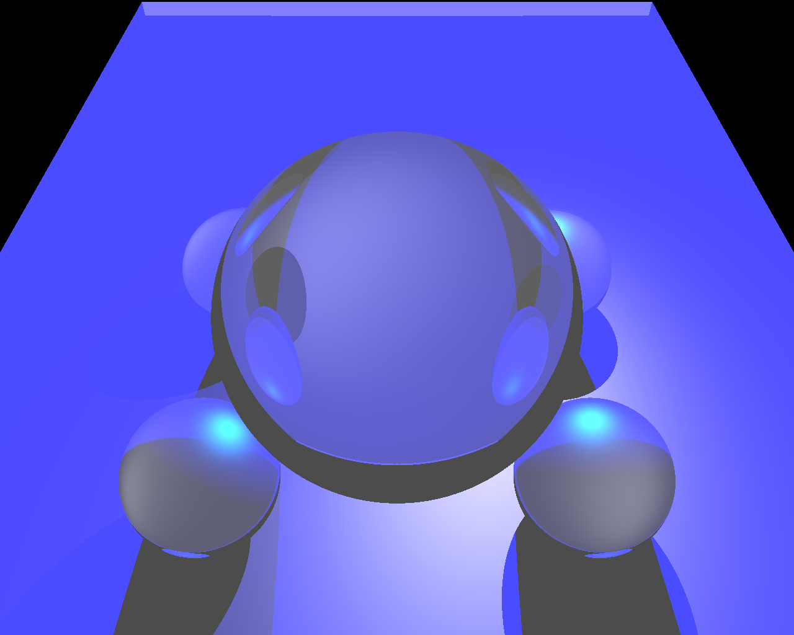

# cse-167-raytracer-ec
Extra credit for our raytracer

## Acceleration structure
I implemented [octree](https://en.wikipedia.org/wiki/Octree) in our raytracer. I wanted to implement binary space partitioning, but this acceleration structure seemed much simpler. It also made the code run much faster, too. Scene 7 went from taking 40+ minutes to about 40 seconds to render. On my partner's laptop, it took *6.8 seconds*. Definitely an amazing speed up.

## STL parsing
I noticed that the STL format is pretty similar to the one that our raytracer uses, so I wrote a program that converts STL files into a format the raytracer can use. It also calculates the center of the model, sets the eye far enough away to see the entire model but not so far that it's hard to see, and sets the up vector to `{0 1 0}`.

Here's the [STL parser](https://github.com/Akhil841/stlparser/).

The results were quite nice. Here's a render of the F-35 Lightning II made with the raytracer. The model had a camouflage texture engraved within, so it looks kind of crunchy.



## Area lighting

My partner also implemented area lighting in our raytracer by using stratified sampling over a set of points and calculating the light for each pixel that way. It made some nice renders!



It also made Scene 6 look way nicer.



The original, for reference:




## Refraction

We also tried to implement refraction, but we weren't able to get the reflectance and transmittance proportions done properly in time.



Here's the code.
```
// refraction
    if (rc > 0)
    {
        float currIndex = 1;
        // going in
        if (glm::dot(normal, glm::vec3(r.dir)) < 0) {
            currIndex = 1.5;
        }
        else {
            normal = -normal;
        }

        float cosI = -glm::dot(glm::vec3(r.dir), normal);
        float n = r.refractiveIndex / currIndex;
        float sinT2 = n * n * (1 - cosI * cosI);

        if (sinT2 > 1) return finalcolor; // no refraction occurs.

        struct Ray transmissionRay;
        glm::vec3 tDir = n * glm::vec3(r.dir) + (n * cosI - sqrt(1 - sinT2)) * normal;
        transmissionRay.dir = glm::vec4(tDir, 0);
        transmissionRay.pos = hitPos + (transmissionRay.dir * 0.001f);
        transmissionRay.refractiveIndex = currIndex;
        glm::vec3 refractionColor = raytrace(transmissionRay, rc - 1, root);
        finalcolor += multCmpWise(glm::vec3(0.5), refractionColor);
        // if (r.refractiveIndex > 1) finalcolor = multCmpWise(glm::vec3(0.5), refractionColor);


    }
```